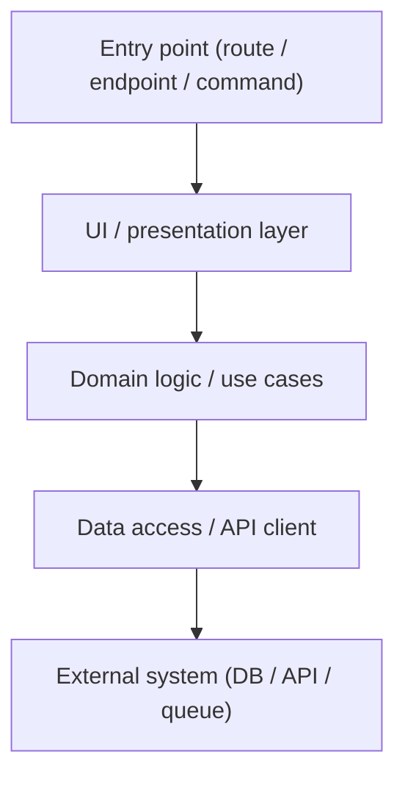
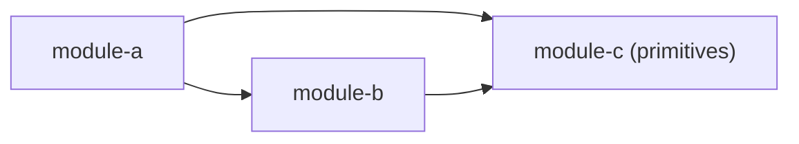

# Wiki Seed

A single-file seed that bootstraps an LLM-maintained knowledge base in any project.

## What this is

This file is the source for a project wiki — a folder of markdown pages that an LLM coding
agent maintains alongside the codebase. The wiki captures everything the code alone doesn't
show: architectural patterns, decisions and their rationale, bug postmortems, known hacks,
tech debt, integration contracts, runbooks, in-flight projects, and the domain glossary.

To activate it, drop this file into a target repo and ask your LLM agent to bootstrap from
it. The agent will create a multi-file `wiki/` folder (one page per concern) and patch your
project's main agent-instructions file (`CLAUDE.md`, `AGENTS.md`, `.cursor/rules`, etc.) so
future tasks consult and update the wiki.

## How to use this file (for humans)

1. Copy `wiki-seed.md` into the root of the target repo.
2. In a fresh agent session, paste:

   > Read `wiki-seed.md` and follow its bootstrap instructions. Show me what you're about to
   > create before writing any files.

3. Review the agent's plan, approve, let it run.
4. Sketch your project's actual architecture and glossary into the placeholder files; the
   rest of the wiki accretes from normal work once the schema is in place.

The seed itself is one file so it's easy to share, version, or paste into a chat. The wiki
it produces is intentionally multi-file — one page per concern keeps each entry tight and
makes individual pages reusable as context.

## How to use this file (for the LLM agent reading it)

When the user asks you to bootstrap from `wiki-seed.md`:

1. **Confirm the target.** Default location is `wiki/` at the repo root. Ask the user if they
   want it somewhere else before writing.

2. **Create the files in section §A below** with the exact contents shown. Use the file path
   in each block's header as the destination.

3. **Create the empty subfolders in section §B** with a `.gitkeep` marker in each so they
   survive `git add`.

4. **Patch the project's main agent-instructions file** (the one the user identifies — usually
   `CLAUDE.md`, `AGENTS.md`, or a `.cursor/rules` file at the repo root). Add the
   integration snippet in section §C near the top, so future tasks read and update the wiki.
   If no such file exists, create `CLAUDE.md` with just that snippet.

5. **Write the first `_log.md` entry** recording the bootstrap:

   ```
   - <YYYY-MM-DD> — Seed wiki bootstrap — meta — Wiki structure scaffolded from `wiki-seed.md`; awaiting first real entries.
   ```

6. **Stop and tell the user** the wiki is seeded, point them at `wiki/architecture.md` and
   `wiki/glossary.md` to sketch in their project's actual shape, and remind them the schema
   in `wiki/CLAUDE.md` is the source of truth for when to update going forward.

7. **Do not delete `wiki-seed.md`** unless the user asks. Leaving it in the repo is fine — it
   documents where the wiki came from.

---

## §A — Files to create

Each block below is one file. The header line gives the destination path; the fenced content
is the literal file content. Fences here use **four backticks** so the embedded files (which
use three) render cleanly.

### `wiki/CLAUDE.md`

````markdown
# Wiki schema

This folder is the project's LLM-maintained knowledge base. It captures everything the code alone
doesn't show: architectural patterns, decisions and their rationale, bug postmortems, known hacks
and tech debt, integration contracts, runbooks, in-flight projects, and the domain glossary.

## Layers (strictly separated)

- **Sources** — read-only ground truth: the codebase, `git log`, GitHub/GitLab PRs, agent
  transcripts, ad-hoc notes a human drops in.
- **The wiki** — this folder. Markdown pages the LLM creates and updates. Sources stay immutable;
  the wiki is a derived artifact that the LLM keeps current as code changes.
- **The schema** — this file. Defines *when* to update the wiki, *how* to write pages, what
  categories exist, and how the taxonomy evolves.

## When to update (treat as a checklist for every non-trivial task)

Before finishing a task, walk this list. If a row applies, write or update the matching page in
the same commit as the code change.

| Trigger | Where to write |
|---|---|
| Architectural shift, new layer, new cross-module pattern | `architecture.md` + maybe a `decisions/` page |
| Non-obvious decision (vendor switch, flag flip, schema split, deprecation) | `decisions/YYYY-MM-DD-slug.md` |
| Non-obvious bug fix with a real root cause | `bugs/YYYY-MM-DD-slug.md` |
| Workaround landing with a "remove when X" condition | `hacks/slug.md` |
| Accepted longer-lived debt | `tech-debt/slug.md` |
| New external system integrated, or an existing one changing contract | `integrations/slug.md` |
| Recurring operational pain point with a known recovery path | `runbooks/slug.md` |
| User-visible capability added or significantly changed | `features/slug.md` |
| New domain term used in code or PR descriptions | `glossary.md` |
| New repeatable team process (PR flow, release dance, codegen loop) | `workflows/slug.md` |

After writing or updating any page, append a one-line entry to `_log.md` in chronological order:
`- YYYY-MM-DD — title — one-sentence summary — commit-or-PR`

## Page templates

Keep pages tight. Every page has a one-line summary at the top so the index can quote it.

### `decisions/YYYY-MM-DD-slug.md`

```markdown
# <title>

> One-line summary.

**Date:** YYYY-MM-DD  **Status:** proposed | accepted | superseded by `[[link]]`

## Context
Why this came up. What constraint forced a choice.

## Options considered
- A — pros / cons
- B — pros / cons

## Decision
What we picked, in one short paragraph.

## Consequences
What changes downstream. What we're now committed to. What gets harder.

## References
- `[[decisions/...]]` superseded
- PR #N, commit `abc1234`
```

### `bugs/YYYY-MM-DD-slug.md`

```markdown
# <title>

> One-line summary.

**Symptom** — what the user or monitoring saw.
**Root cause** — what was actually wrong, in plain language.
**Fix** — what changed, with file refs.
**Lessons** — what to look for next time. Link any `runbooks/` page that came out of it.

## References
PR #N, commit `abc1234`
```

### `hacks/slug.md`

```markdown
# <title>

> One-line summary.

**What it does** — short, neutral description.
**Why it exists** — the constraint that forced the workaround.
**Remove when** — the concrete condition that retires the hack. If you can't state one, this is
debt, not a hack — move it to `tech-debt/`.
**Files** — paths involved.
```

### `tech-debt/slug.md`

```markdown
# <title>

> One-line summary.

**What it is** — what's not ideal.
**Why it's that way** — original constraint.
**Current cost** — concrete pain it causes today.
**When to fix** — trigger that would justify the work. Often "next time we touch X".
```

### `runbooks/slug.md`

```markdown
# <title>

> One-line summary of when to use this runbook.

## Trigger
What you saw that made you open this page.

## Steps
1. Concrete command or click.
2. ...

## Verification
How you know it worked.

## Related
Link any `bugs/` postmortem that inspired this runbook.
```

### `features/slug.md`

```markdown
# <title>

> One-line summary of the user-visible capability.

**Where** — route(s) or entry point in the app.
**What users see** — the screen, the controls, the data.
**How it's wired** — top-down: page → components → hooks → API call → backend endpoint.
**Specs** — paths to E2E specs or other behavioural tests covering this feature.
```

### `integrations/slug.md`

```markdown
# <title>

> One-line summary of the external system.

**What we use it for** — surfaces in the app that depend on it.
**Contract** — the shape of the request/response we rely on. Cite OpenAPI / vendor doc URL.
**Auth & config** — where credentials live, which env vars matter.
**Gotchas** — quirks we've hit. Link `bugs/` postmortems.
```

### `apps/slug.md`

One per runtime surface (each module, service, or app that has its own dev/build/run lifecycle).

```markdown
# <name>

> One-line summary.

**Purpose** — why this surface exists.
**How to run it** — the commands.
**Layers** — top-down dependency on other modules.
**Notable internals** — anything non-obvious to a new reader.
```

### `workflows/slug.md`

```markdown
# <title>

> One-line summary.

**When** — the trigger.
**Steps** — numbered, with exact commands.
**Gotchas** — anything you have to remember.
```

## Tone & length

- One-line summary at the top of every page. The index re-uses it.
- Bullet points over prose. Code refs as inline backticks (`file_path:line`).
- Cross-link with relative paths in `[[...]]` form for graph view, plus markdown `[label](path)`
  for tools that don't grok wikilinks.
- If a page grows past ~200 lines, split it. If a folder gets >20 files, group by sub-folder.

## Evolving the schema

Categories exist to make the page easy to find. When content stops fitting:

1. Propose a new folder or page-template here in `CLAUDE.md`.
2. Add it to the directory tree in the project README.
3. Add a `_log.md` entry explaining why.

When in doubt, don't write. A noisy wiki is worse than a quiet one. Skip mechanical fixes,
formatting churn, type bumps, dependency upgrades — unless they encode a real decision.

## Exclusions

The wiki is markdown content the agent maintains. Treat it as documentation, not code:

- Exclude the `wiki/` folder from your formatter (Prettier, Biome, etc.). Format conflicts and
  whitespace churn confuse the agent and bloat diffs.
- Exclude the `wiki/` folder from your type-checker / linter. If you use a per-module
  `tsconfig.json`, don't include `wiki/` in any of them.
- Don't apply your code-review automation (spell-check on identifiers, etc.) to wiki content.

The wiki is **not** a substitute for code comments where the WHY is non-obvious. If a single line
of code needs a comment, write the comment. The wiki is for context that spans files or sessions.
````

### `wiki/_log.md`

````markdown
# Wiki log

Chronological changelog of wiki updates. One line per page added or significantly changed, in
order of when the entry was written. Newest entries at the bottom.

Format: `- [<title>](<path>) — <category> — <one-sentence summary>`

<!-- Bootstrap agent: replace this comment with the first real entry, e.g.

- <YYYY-MM-DD> — Seed wiki bootstrap — meta — Wiki structure scaffolded from `wiki-seed.md`; awaiting first real entries.
-->
````

### `wiki/index.md`

````markdown
# Wiki index

Map of content. Pages carry their own one-line summary at the top; this index quotes it.

## Start here

- [`architecture.md`](architecture.md) — layered model + worked end-to-end example.
- [`glossary.md`](glossary.md) — domain vocabulary with code references.
- [`CLAUDE.md`](CLAUDE.md) — schema: when to update, how to write pages.
- [`_log.md`](_log.md) — chronological changelog of wiki updates.

<!-- As you add pages, group them under the headers below. Each entry should be:
     - [`path/to/page.md`](path/to/page.md) — **<title>** — <one-line summary copied from the page>
     Delete a section header if it's empty. Add new headers as new categories emerge. -->

## Apps

<!-- One page per runtime surface (web app, API service, CLI, mobile, etc.). -->

## Features

<!-- User-visible capabilities, top-down: route → component → API. -->

## Decisions

<!-- Non-obvious decisions with date prefix: YYYY-MM-DD-slug.md. Newest at top. -->

## Bugs

<!-- Postmortems for non-obvious bugs. Date-prefixed: YYYY-MM-DD-slug.md. -->

## Runbooks

<!-- Recurring operational pain points with known recovery paths. -->

## Tech debt

<!-- Accepted longer-lived debt with current-cost notes. -->

## Hacks

<!-- Workarounds with concrete "remove when" conditions. -->

## Integrations

<!-- External systems and the contracts you rely on. -->

## Workflows

<!-- Repeatable team processes (release dance, PR flow, codegen loop, …). -->
````

### `wiki/architecture.md`

````markdown
# Architecture

> Layered model for this project — how every new feature flows from entry point to data source.

<!-- TODO: Replace the placeholders below with your project's actual structure. The shape of
this page is the important part — module map, dependency rules, a worked end-to-end example.
What's in each section will be project-specific. -->

## Module map

```
<repo-root>/
  <module-a>/   Short description of what lives here.
  <module-b>/   Short description.
  <module-c>/   Short description.
  …
```

<!-- Use a flat list if you have ~10 modules. Use a tree if there's meaningful nesting.
Mention which modules are pure libraries (no dev/run lifecycle) and don't get an apps/ page. -->

## Layered model (top-down)

<!-- Replace this Mermaid diagram with your project's actual entry-point → data flow. The point
is to show the chain a request takes through the codebase, not to be exhaustive. -->



### Module dependency rules

<!-- The arrows below are the only imports allowed between modules. Add a Mermaid graph that
shows allowed edges. Then list the hard rules below. -->



**Hard rules** (encoded in the graph above):

- `module-b` must not import from `module-a`.
- `module-c` must not import from anything else — it's a primitive.
- Business logic belongs at the `<right>` layer, not inside `<wrong>` components.

<!-- Add 3–6 rules. These are the ones that, if violated, cause real harm (circular imports,
broken builds, leaking concerns). Don't list aspirations here — list invariants. -->

## Worked example: <pick a real feature>

<!-- Walk one real feature top-down. This is the most valuable section of this page because it
shows new contributors (and the LLM) what "doing it right" looks like in this codebase. Pick a
feature that exercises every layer. Cite file paths with line numbers. -->

### 1. <Entry point>

`<path/to/entry/point>:<line>`

What it does in one paragraph. What it calls into.

### 2. <Next layer>

`<path/to/next-layer>:<line>`

What it does. What state it owns vs what comes from above.

### 3. <Data layer>

`<path/to/data-call>:<line>`

The actual API/DB call. Auth. Error handling.

### 4. <External contract>

The endpoint / table / queue the feature ultimately depends on. Link to `integrations/<slug>.md`
if applicable.

## Conventions worth knowing

<!-- Patterns the code follows that aren't obvious from any single file:
- How state is managed
- How forms are built
- How errors propagate
- How tests are organized
- Anything else a new contributor would otherwise have to grep for. -->

- TODO
- TODO
- TODO
````

### `wiki/glossary.md`

````markdown
# Glossary

> Domain terms used across the codebase. Alphabetical, with code references where a clean home
> exists.

<!-- Use this page for words that mean something specific in your domain — words that
non-domain-experts would misunderstand, or words where the codebase uses one term for what the
business calls something else. Don't pad with generic engineering terms ("React component",
"REST endpoint") — those belong in the README or onboarding doc, not here.

Format per entry:

## <Term>

One- or two-sentence definition in the project's own voice.
**Code:** `<path/to/file>:<line>` if the term has a canonical type/constant.
**Related:** [[Other Term]], [[Another Term]] — link to other glossary entries that share context.

Keep entries short. If an entry grows past a paragraph, it probably wants its own `features/`
or `decisions/` page, with the glossary just pointing at it. -->

## <First term>

TODO: what this means in your domain.

## <Second term>

TODO.
````

---

## §B — Empty subfolders to create

Create each of the following as an empty folder under `wiki/`, with a `.gitkeep` marker file
inside so it survives `git add`:

- `wiki/apps/.gitkeep` — one page per runtime surface (web app, API service, CLI, mobile, …)
- `wiki/bugs/.gitkeep` — postmortems for non-obvious bugs
- `wiki/decisions/.gitkeep` — recorded decisions with context, options, consequences
- `wiki/features/.gitkeep` — user-visible capabilities, top-down: route → component → API
- `wiki/hacks/.gitkeep` — workarounds with concrete "remove when" conditions
- `wiki/integrations/.gitkeep` — external systems and the contracts you rely on
- `wiki/runbooks/.gitkeep` — recurring operational pain points with recovery steps
- `wiki/tech-debt/.gitkeep` — accepted longer-lived debt with current-cost notes
- `wiki/workflows/.gitkeep` — repeatable team processes (release dance, PR flow, codegen loop, …)

---

## §C — Integration snippet for the project's main agent instructions

Insert the snippet below near the top of the receiving project's main agent-instructions file
(usually `CLAUDE.md` at the repo root, but it could be `AGENTS.md`, `.cursor/rules/*.md`, etc.).
Put it under the project description but above task-specific guidance, so the agent sees it
early on every session.

> ## Project knowledge base — `wiki/`
>
> `wiki/` is an LLM-maintained knowledge base for this project. It captures everything the code
> alone doesn't show: architectural patterns, decisions and their rationale, bug postmortems,
> known hacks and tech debt, integration contracts, runbooks, in-flight projects, and the
> domain glossary.
>
> **On every non-trivial task in this project, before starting work:**
>
> - Read `wiki/CLAUDE.md` — the schema. It defines when to update the wiki and how to write
>   pages. Treat the schema's "When to update" table as a checklist for the current task.
> - Skim `wiki/index.md` — the map of content. Find the pages relevant to the area you're
>   touching. Read them. The wiki is the fastest way to absorb context that took prior sessions
>   hours to learn.
>
> **While working:**
>
> - If a decision is made, a non-obvious bug is fixed, a hack is added, an integration changes,
>   a domain term comes up, or an incident is handled — create or update the relevant wiki
>   page per the schema. Append a one-line entry to `wiki/_log.md`. Wiki updates land in the
>   same commit (or PR) as the code change that triggered them, so `git log` ties them
>   together.
> - The wiki is excluded from your formatter and type-checker (see `wiki/CLAUDE.md` §
>   Exclusions). Mirror that exclusion in your tooling so the agent isn't fighting lint
>   warnings on markdown.
>
> **For new feature work:**
>
> `wiki/architecture.md` contains your project's layered model. Update it as the system evolves;
> reference it when scaffolding new features.

---

## Why an LLM-maintained wiki

Code shows the *what*. Comments show the local *why*. Neither captures the cross-file
patterns, the decisions that constrained today's code, the workarounds you forgot you accepted,
or the operational fixes you discovered at 2am six months ago. A maintained wiki is where that
context lives so the next session — human or LLM — doesn't waste hours rediscovering it.

The trick to making it work is that updating the wiki has to be part of normal work, not a
separate documentation chore. The schema treats wiki updates as a checklist item alongside lint
and tests: walk the "When to update" table at the end of every task. Most tasks don't trigger
anything; the ones that do produce one or two short pages. Over months, those pages compound
into a knowledge base nobody had time to write deliberately but everyone benefits from.

## License

This seed is free to use, copy, and modify in any project. No attribution required.
