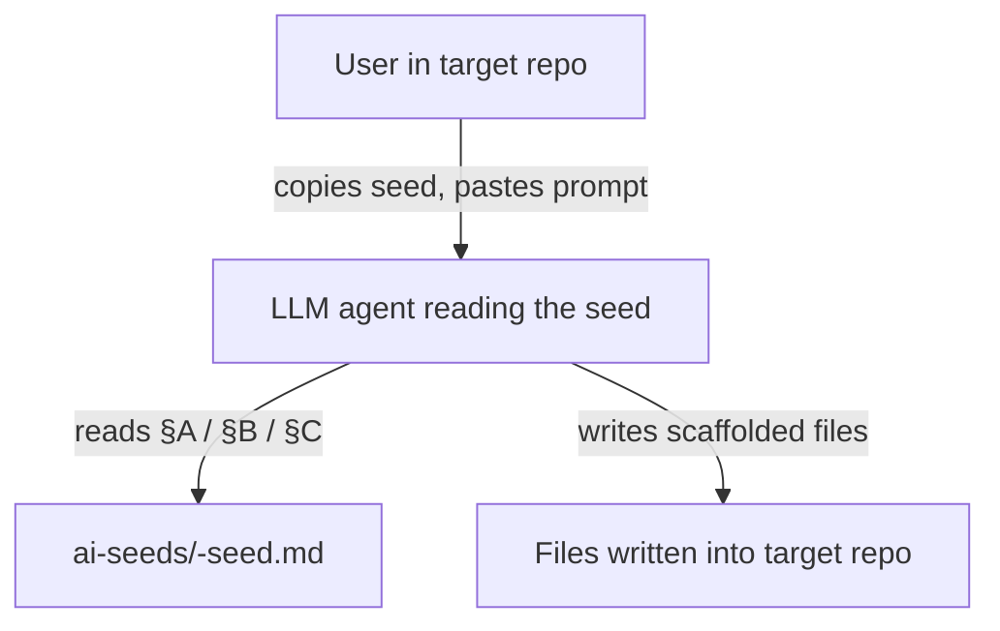

# Architecture

> Two-bucket repo: LLM bootstrap **seeds** (markdown an agent expands into a target repo) and copy-in **code-quality configs** (ESLint, Prettier, TypeScript) for new projects. No build, no runtime.

## Module map

```
ai-utils/
  ai-seeds/             Single-file markdown seeds; each is self-expanding when handed to an LLM agent.
    wiki-seed.md          Bootstraps wiki/ in a target repo (this file produced the wiki you're reading).
    agents-seed.md        Bootstraps six Claude Code subagents + three CLAUDE.md protocol sections.
  code-quality-tools/   Plain config files; consumer copies and adapts to their project layout.
    eslint.config.mjs     Flat-config ESLint for TS + React + Prettier.
    prettier.config.js    Formatting preferences.
    tsconfig.json         Strict TS baseline; no project-specific paths/include.
  field-notes/          Longer-form write-ups (design rationale, retros) that don't fit in a seed.
  wiki/                 This knowledge base.
  CLAUDE.md             Agent instructions for working in this repo.
  README.md             Human overview of the repo.
```

No build, no test runner, no source compilation. The repo is *content* (markdown + standalone configs) consumed by humans and LLM agents who drop pieces into target repos.

## Layered model — the bootstrap loop

This repo isn't a runtime, so there's no entry-point → data flow. Instead, the "flow" is how a seed reaches a target repo:



For `code-quality-tools/`, the loop is shorter — the human copies files directly, no agent needed.

### Module dependency rules

There are no imports between markdown files. Soft coupling rules:

- **`agents-seed.md` references `wiki/...` paths** that come from `wiki-seed.md`. When editing one, check the other still lines up. The two seeds are designed to compose but each works standalone (critics degrade gracefully without a wiki).
- **`code-quality-tools/eslint.config.mjs` imports JS packages** (`typescript-eslint`, `eslint-plugin-react`, etc.) that the *consumer* project must install. The config itself is just text in this repo.
- **Field notes are write-once** — they capture a design at a moment in time. If a design evolves, write a new entry, don't edit the old one.

## Worked example — how `wiki-seed.md` got used to produce this wiki

### 1. Human action

User said "run the wiki seed on yourself" in a fresh agent session inside `ai-utils`.

### 2. Agent read the seed's §A / §B / §C

`ai-seeds/wiki-seed.md` contains:
- §A: literal file contents fenced with **four backticks** (so embedded 3-backtick examples render).
- §B: list of empty subfolders to create with `.gitkeep` markers.
- §C: integration snippet to insert into the host project's main agent-instructions file.

### 3. Agent wrote files into this repo

Wrote `wiki/CLAUDE.md`, `wiki/_log.md`, `wiki/index.md`, `wiki/architecture.md`, `wiki/glossary.md`, plus `.gitkeep` markers in the empty subfolders, then patched the root `CLAUDE.md` with the §C snippet.

### 4. Wiki accretes from normal work

From here, every non-trivial change walks `wiki/CLAUDE.md`'s "When to update" checklist. Pages land in the same commit as the code change that triggered them; `wiki/_log.md` gets a one-line entry per change.

## Conventions worth knowing

- **Four-backtick fencing inside seeds.** Embedded files use three backticks; the outer block uses four so the content survives copy-paste.
- **Customization seams in `agents-seed.md`** (the `<DEFAULT_BRANCH>`, `<HELPER_LOCATIONS>`, `<PROJECT_TRAPS>` placeholders) — the host agent must fill these in *with the user* before writing files. See [[decisions/2026-06-20-config-baseline-scope]] for the analogous scope-narrowing decision made on the code-quality configs.
- **Commit style** — gitmoji + Angular-style `[type]:` brackets, no Claude co-author trailer. See [[workflows/commit-style]] for the full convention.
- **No CI, no tests.** Review is reading the markdown. The `code-quality-tools/` configs are reviewed by humans (and used by future consumer projects); they aren't run against this repo.
